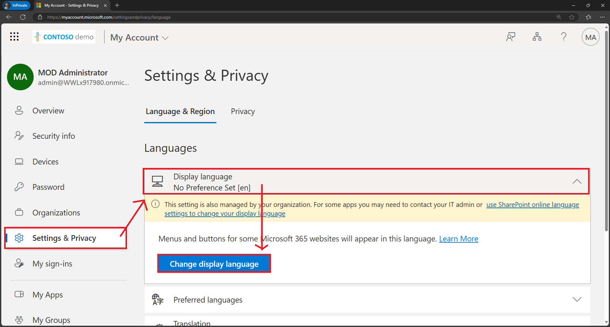
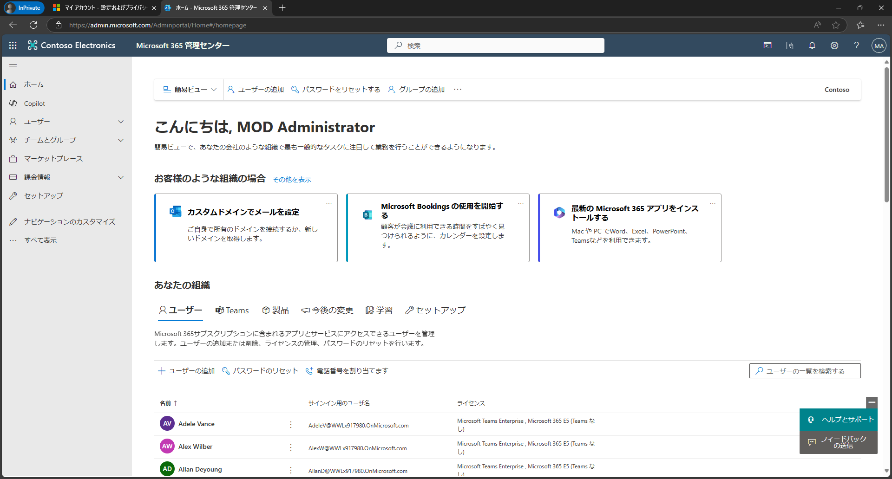
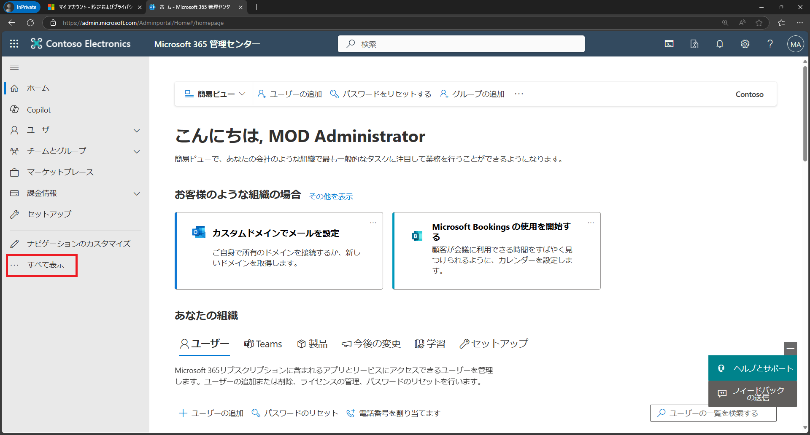
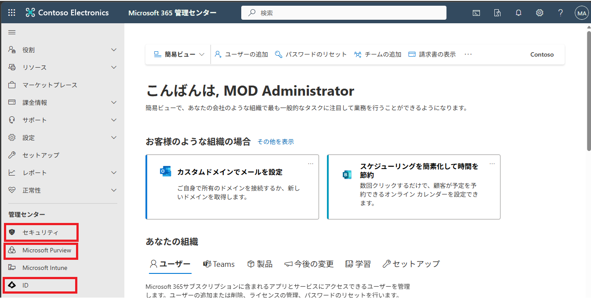
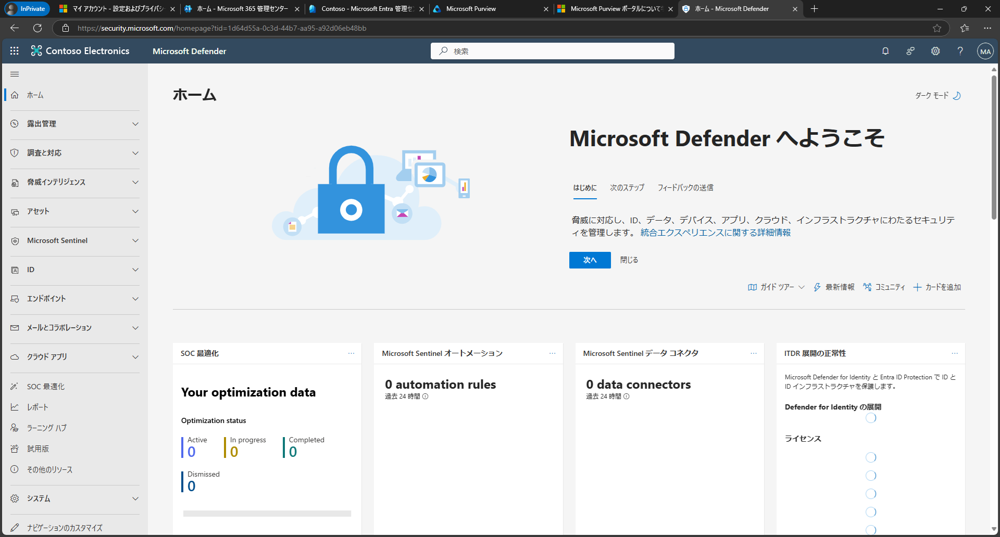
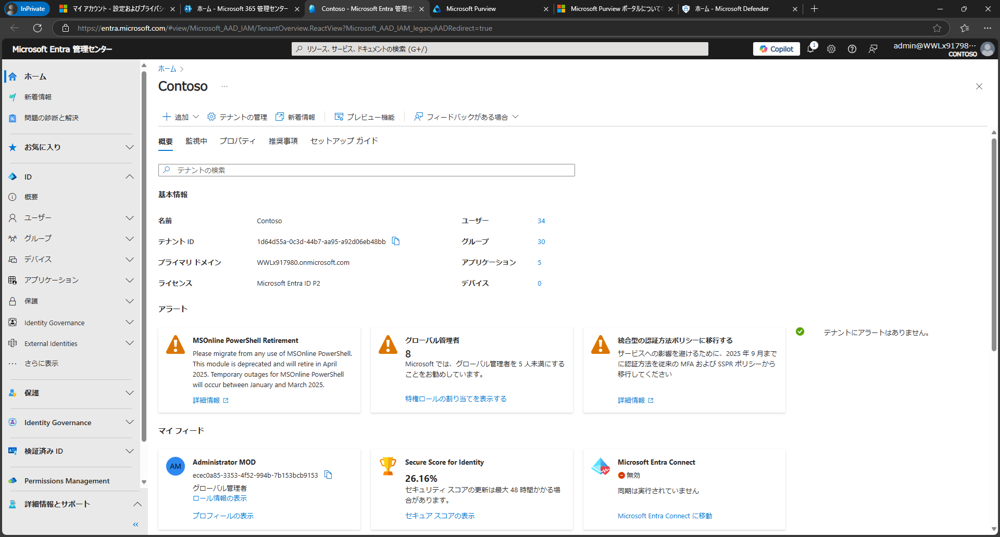
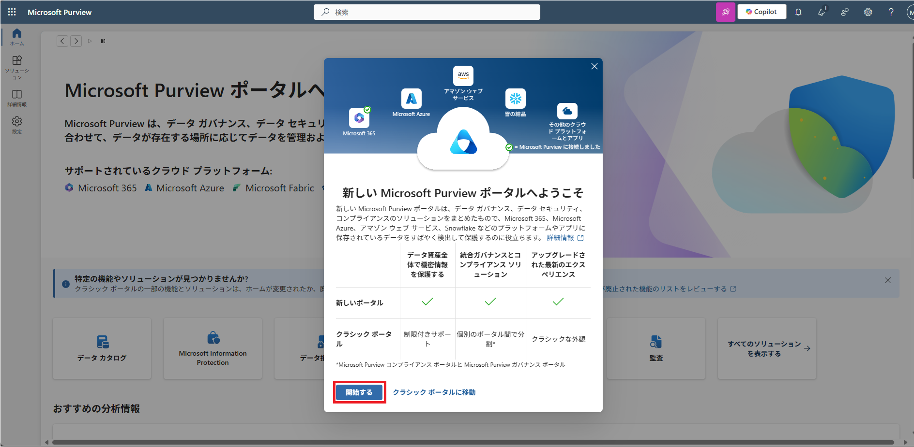

# ラボ 01：Microsoft365管理センターへサインイン

#### 推定時間: 15 分

## タスク1 - 表示言語を日本語化する

1. InPrivate ウィンドウ(Microsoft Edge) もしくは、シークレットウィンドウ (Google Chrome) を起動します。

   > 注：以降の演習はすべてInPrivate もしくは、シークレットウィンドウ で実施してください。

2. https://myaccount.microsoft.com/ へアクセスし、以下のアカウントでサインインします。

   > 注：ハイパーリンクを開く際は、リンクを右クリックし[新しいタブで開く]等で開いてください。
   >
   > 注：XXXXはご自身のアカウント番号を入力してください。
   >
   > 注：[アカウントの保護にご協力ください]と表示された場合は[今はしない]を選択してください

   | 項目       | 値                                                           |
   | ---------- | ------------------------------------------------------------ |
   | ユーザーID | `admin@XXXXXXXXXXX.onmicrosoft.com` @マーク以降のXXXXXXXXXは各自異なります。 |
   | パスワード | Skillableで取得したパスワード                                |

   

3. [サインインの状態を保持しますか] ページでは、 [いいえ] をクリックします 。

4. [My Account]のページにサインインされます。画面左にある[Settings & Privacy]をクリックします。

5. [Settings & Privacy]の画面にある[Display language]をクリックし、さらに[Change display language]をクリックします。

   

   

6. [Languages]の一覧から[Japanese]を選択し[Select]をクリックします。

7. [Update display language] と表示されますので、[Update]をクリックします。

8. 表記が日本語に変わります。[はい、今すぐサインアウト]をクリックします。

9. [どのアカウントをサインアウトしますか?]と聞かれますので、[MOD Administrator]をクリックします。

10. [サインアウトする間、しばらくお待ちください。]と表示されます。

11. サインアウト後に[アカウントを選択する]に画面が切り替わります。[admin]のアカウント]を選択し、パスワード入力後にサインインします。

12. 日本語に表記が変わったことを確認します。

## タスク2 - Microsoft365管理センターへサインイン

1. Microsoft 365 管理センター https://admin.microsoft.com へアクセスし、以下のアカウントでサインインします。

   > 注：ハイパーリンクを開く際は、リンクを右クリックし[新しいタブで開く]等で開いてください。
   >
   > 注：XXXXはご自身のアカウント番号を入力してください。
   >
   > 注：[アカウントの保護にご協力ください]と表示された場合は[今はしない]を選択してください

   | 項目       | 値                                                           |
   | ---------- | ------------------------------------------------------------ |
   | ユーザーID | `admin@XXXXXXXXXXX.onmicrosoft.com` @マーク以降のXXXXXXXXXは各自異なります。 |
   | パスワード | Skillableで取得したパスワード                                |

   

1. Microsoft 365 管理センターへアクセスすることができました。

   

## タスク3 - 各管理センターへアクセスする

1. Microsoft 365 管理センターの画面左にある[すべて表示]をクリックします。

   

   

2. 下にスクロールすると[管理センター]項目が表示されます。

   

3. [セキュリティ]、[コンプライアンス]、[ID]をそれぞれクリックします。

   

   

4. 各管理センターが表示されたことを確認します。

   ※↓[セキュリティ]は[Microsoft Defender ポータル]が表示されます。

   

   

   ※↓[ID]は[Microsoft Entra 管理センター]が表示されます。

   

   

5. [コンプライアンス]のみ、新しくポータルサイトが変わりました。自動で切り替わります。

6. [新しい Microsoft Purview ポータルへようこそ]と表示された場合、[開始する]を選択します。

   

   

7. これで今回使用する管理センターにすべてアクセスできました。

   

   **参考：各管理センターの説明**

   > 注：ハイパーリンクを開く際は、リンクを右クリックし[新しいタブで開く]等で開いてください。
   
   | 表示名           | 管理センター名                          | 詳細                                                         | URL                              |
   | ---------------- | --------------------------------------- | ------------------------------------------------------------ | -------------------------------- |
   | セキュリティ     | Microsoft 365 Defender ポータル         | Microsoft Defender（Microsoft 365 Defender）は、マイクロソフトが提供する統合型のセキュリティプラットフォームです。 エンドポイント（PC・モバイルなど）や電子メール、クラウドアプリケーションなどに対して包括的な脅威防御、検出、対応機能を提供し、セキュリティリスクの軽減に貢献します。 | https://security.microsoft.com   |
   | コンプライアンス | Microsoft Purview (Compliance) ポータル | Microsoft Purview は、組織内のデータガバナンスやコンプライアンス管理を行うための統合ソリューションです。 情報保護やデータ分類、データライフサイクル管理、監査レポートなどを一元的に管理・監視し、セキュリティとコンプライアンスの向上に役立ちます。 | https://compliance.microsoft.com |
   | ID               | Microsoft Entra 管理センター            | Microsoft Entra は、アイデンティティおよびネットワークアクセスを包括的に管理するプラットフォームです。 アイデンティティ管理やアクセス制御、権限管理、検証済みIDなどを統合的に提供し、組織のセキュリティと効率的なアクセス管理をサポートします。 | https://entra.microsoft.com      |
   
   

**Lab01 は以上です。お疲れ様でした。**
