# ラボ02：Microsof  Defenderを探索する

#### 推定時間: 20 分

> 注：タスク1以降は、どのタスクから実施してもOKです。

### タスク 1 - Microsoft Defender ポータルにアクセスする

1. https://security.microsoft.com/ へアクセスし、以下のアカウントでサインインします。

   > 注：ハイパーリンクを開く際は、リンクを右クリックし[新しいタブで開く]等で開いてください。
   >
   > 注：XXXXはご自身のアカウント番号を入力してください。
   >
   > 注：[アカウントの保護にご協力ください]と表示された場合は[今はしない]を選択してください

   | 項目       | 値                                                           |
   | ---------- | ------------------------------------------------------------ |
   | ユーザーID | `admin@XXXXXXXXXXX.onmicrosoft.com` @マーク以降のXXXXXXXXXは各自異なります。 |
   | パスワード | Skillableで取得したパスワード                                |

   

2. [Microsoft Defender ポータル]が表示されます。

   

### タスク 2 - セキュアスコアを表示する

1. 左側の[ナビゲーションを表示する] から [露出管理] ⇒ [セキュアスコア] の順でクリックします。

> [解説]
>
> **Microsoft Secure Score** は、組織のセキュリティ体制を数値化して評価する指標であり、**Microsoft Defender ポータル**から直接確認・管理できます。このスコアは、組織がどれだけセキュリティのベストプラクティスに従っているかを示すもので、推奨されるアクションを実施することでスコアが上昇し、全体的なセキュリティ体制の強化に繋がります。
>
> https://learn.microsoft.com/ja-jp/defender-xdr/microsoft-secure-score
>
> 注：ハイパーリンクを開く際は、リンクを右クリックし[新しいタブで開く]等で開いてください。

2. [Microsoft セキュア スコア]ページが表示されます。さらに「Microsoft セキュア スコア を表示する」ボタンをクリックしてページを移動し、一通り確認します。

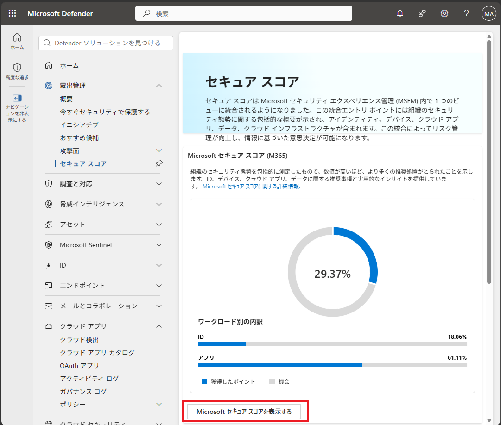

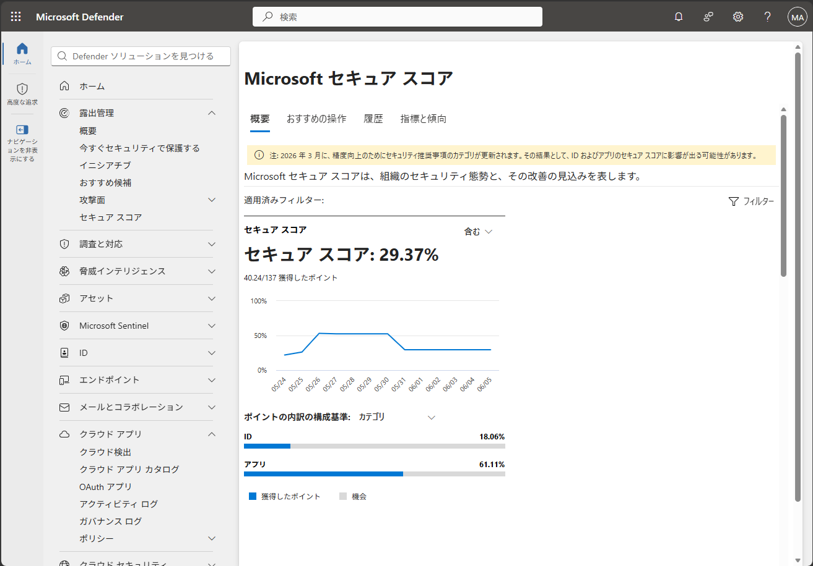

### タスク 3 - メールとコラボレーションで[攻撃シミュレーション]を設定する

> [解説]
>
> **Microsoft Defender for Office 365（メールとコラボレーションの保護）** は、Microsoft 365 環境内のメールやコラボレーションツール（例：Exchange Online、SharePoint、OneDrive、Teams）を対象とした**脅威防御ソリューション**です。これにより、フィッシング攻撃、マルウェア、スパム、ゼロデイ攻撃など、さまざまなサイバー脅威から組織を保護できます。
>
> 本演習では、いくつかある機能のうち、[攻撃シミュレーション]を試していただきます。
>
> https://learn.microsoft.com/ja-jp/defender-office-365/mdo-deployment-guide
>
> 注：ハイパーリンクを開く際は、リンクを右クリックし[新しいタブで開く]等で開いてください。

1. 左側の[ナビゲーションを表示する] から [メールとコラボレーション]⇒[攻撃シミュレーション トレーニング]の順でクリックします。

2. [攻撃シミュレーション トレーニングへようこそ]と表示された場合は[閉じる]をクリックします。

3. [攻撃シミュレーション トレーニング]で[シミュレーション]をクリックし、さらに[シミュレーションの開始]をクリックします。

   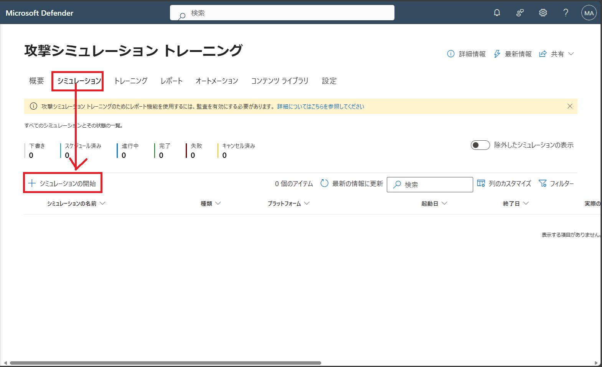

   

4. [技法の選択]では[マルウェアの添付ファイル]を選択し、画面下にある[次へ]をクリックします。

   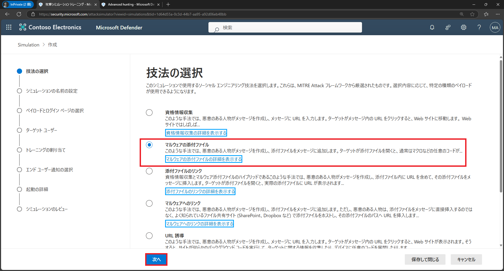

   

5. [シミュレーションの名前]は[test]と入力し、画面下にある[次へ]をクリックします。

   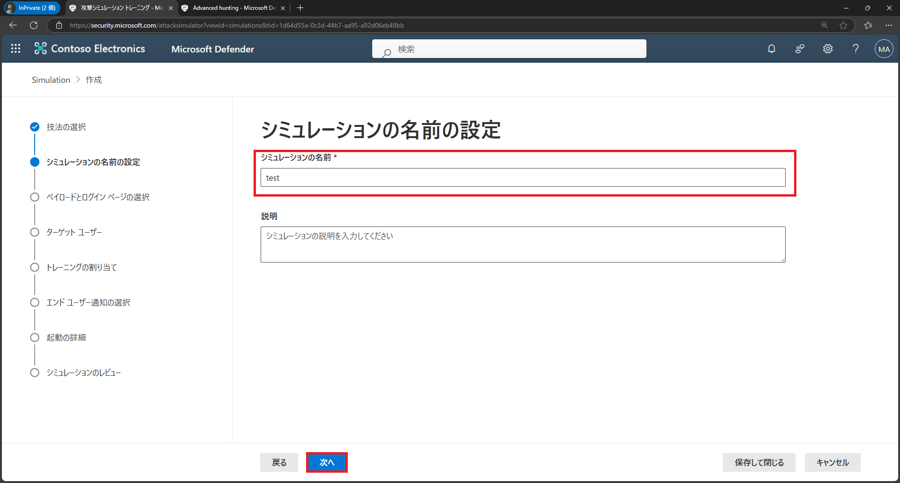

   

6. [ペイロードとログイン ページの選択]では下にスクロールし[Famima T Card Usage]を選択し、画面下にある[次へ]をクリックします。

   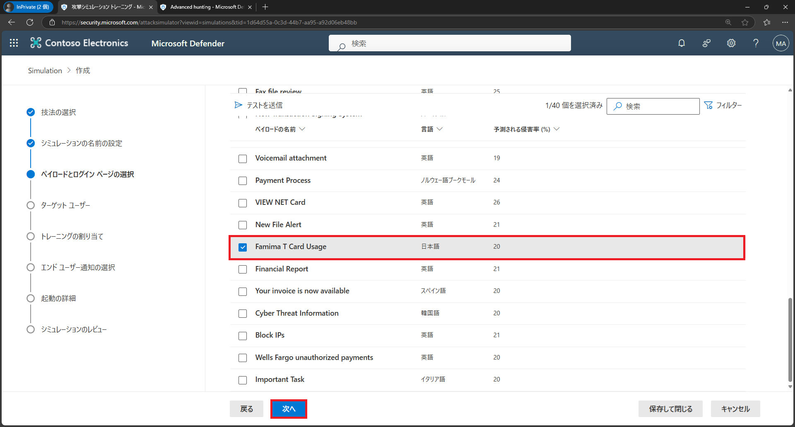

   

7. [ターゲット ユーザー]では[組織内のすべてのユーザーを含める]を選択し、画面下にある[次へ]をクリックします。

   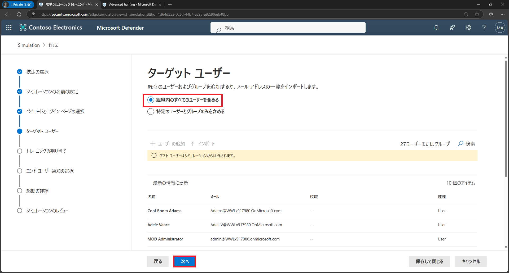

   

8. [ユーザーを除外する]では、変更せずに画面下にある[次へ]をクリックします。

9. [トレーニングの割り当て]では、変更せずに画面下にある[次へ]をクリックします。

10. [フィッシングのランディング ページを選択する]では[Microsoft Landing Page Template 1]を選択し、画面下にある[次へ]をクリックします。

    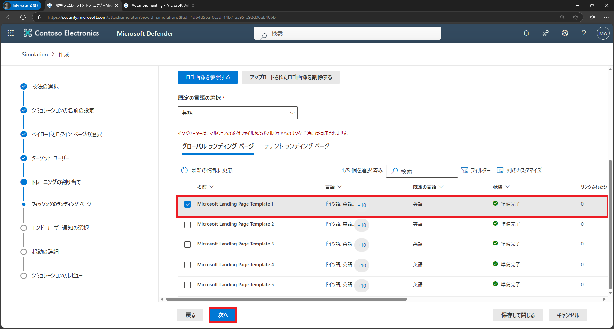

    

11. [エンド ユーザー通知の選択]では[通知を配信しない]を選択し、[警告]では[続行]を押し、画面下にある[次へ]をクリックします。

    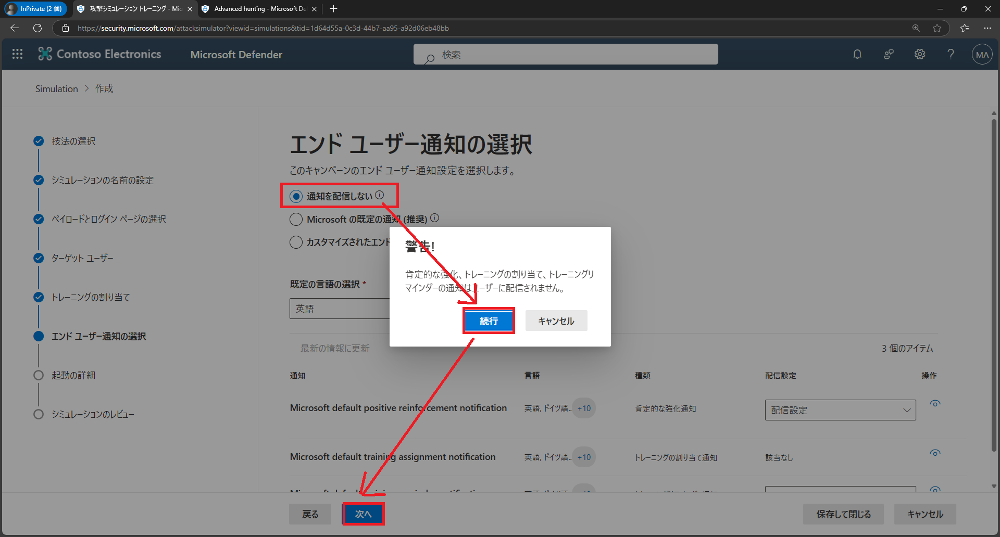

    

12. [起動の詳細]では、変更せずに画面下にある[次へ]をクリックします。

13. [シミュレーションのレビュー]では[テストメールを送信]をクリックし、[確認]をクリックします。最後に[送信]をクリックします。

    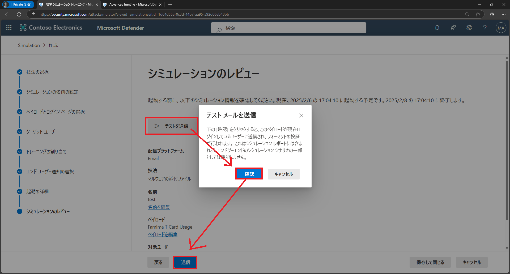

14. [シミュレーションの起動がスケジュールされました]と表示されます。[完了]をクリックします。

15. 新しいタブで https://outlook.office.com/ へアクセスし、以下のアカウントでサインインします。

    > 注：ハイパーリンクを開く際は、リンクを右クリックし[新しいタブで開く]等で開いてください。
    >
    > 注：XXXXはご自身のアカウント番号を入力してください。
    >
    > 注：[アカウントの保護にご協力ください]と表示された場合は[今はしない]を選択してください

    | 項目       | 値                                                           |
    | ---------- | ------------------------------------------------------------ |
    | ユーザーID | `admin@XXXXXXXXXXX.onmicrosoft.com` @マーク以降のXXXXXXXXXは各自異なります。 |
    | パスワード | Skillableで取得したパスワード                                |

    

16. メールボックスに[ファミマTカード利用確認]というダミーのマルウェアが添付されたメールが届きます。

    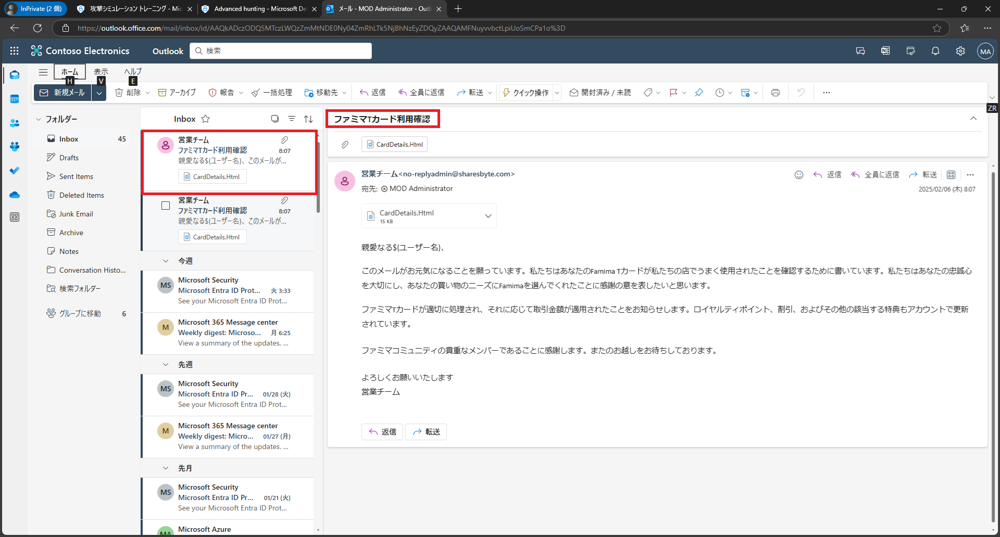

### タスク 4 - クラウドアプリを表示する

> [解説]
>
> **Microsoft Defender for Cloud Apps**（旧称: Microsoft Cloud App Security）は、組織が使用する **クラウドアプリケーション** のセキュリティと可視性を強化するための **クラウドアクセスセキュリティブローカー（CASB: Cloud Access Security Broker）** ソリューションです。このサービスは、企業がクラウドサービスの利用状況を監視し、不正アクセスやデータ漏洩を防ぐための包括的なツールを提供します。
>
> https://learn.microsoft.com/ja-jp/defender-cloud-apps/what-is-defender-for-cloud-apps
>
> 注：ハイパーリンクを開く際は、リンクを右クリックし[新しいタブで開く]等で開いてください。

1. 左側の[ナビゲーションを表示する] から [クラウドアプリ]⇒[クラウド検出]の順でクリックします。

   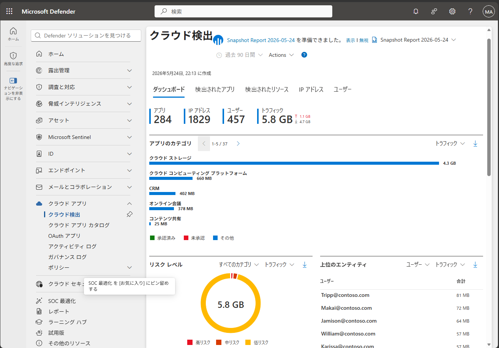

2. 初めてのアクセスの場合時間がかかることがあります(※)が、[クラウド検出]ページが表示されます。全体を一通り確認します。

**Lab02は以上です。お疲れ様でした。**
