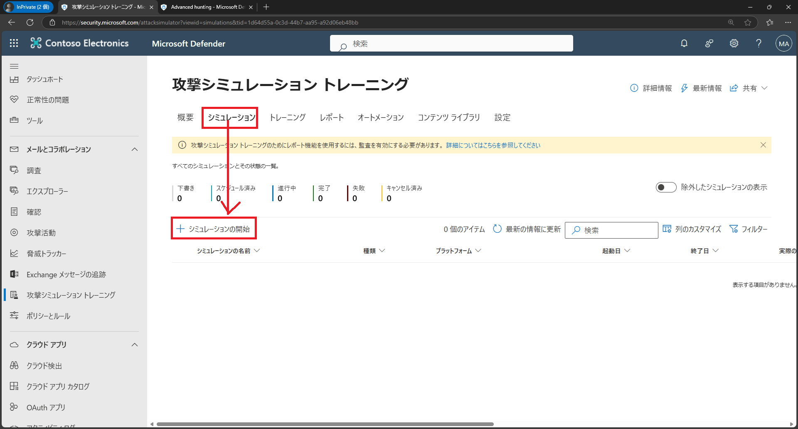

# ラボ02：Microsof  Defenderを探索する

#### 推定時間: 30 分

> 注：タスク1以降は、どのタスクから実施してもOKです。

### タスク 1 - Microsoft Defender ポータルにアクセスする

1. https://security.microsoft.com/ へアクセスし、以下のアカウントでサインインします。

   > 注：ハイパーリンクを開く際は、リンクを右クリックし[新しいタブで開く]等で開いてください。
   >
   > 注：XXXXはご自身のアカウント番号を入力してください。
   >
   > 注：[アカウントの保護にご協力ください]と表示された場合は[今はしない]を選択してください

   | 項目       | 値                                                           |
   | ---------- | ------------------------------------------------------------ |
   | ユーザーID | `admin@XXXXXXXXXXX.onmicrosoft.com` @マーク以降のXXXXXXXXXは各自異なります。 |
   | パスワード | Skillableで取得したパスワード                                |

   

2. [Microsoft Defender ポータル]が表示されます。

   

   

### タスク 2 - 露出管理を表示する

> [解説]
>
> **Microsoft Defender の露出管理**（**Microsoft Defender External Attack Surface Management：EASM**）は、組織が外部からどのように見えるか、つまり攻撃者視点での[攻撃対象領域（Attack Surface）]を可視化・管理するための機能です。これにより、外部に公開されている資産や潜在的な脆弱性を特定し、リスクを低減することが可能になります。
>
> https://www.microsoft.com/ja-jp/security/business/cloud-security/microsoft-defender-external-attack-surface-management
>
> 注：ハイパーリンクを開く際は、リンクを右クリックし[新しいタブで開く]等で開いてください。

1. 左側のナビゲーション メニューの [露出管理]をクリックし、[概要]をクリックします。

   > 注：クリック後に2～3分ほど収集に時間がかかります。画面が変わらない場合はWebブラウザを再読み込みしてください。

   

2. [露出管理の概要]ページが表示されます。全体を一通り確認します。

3. 左側のナビゲーション メニューの [セキュアスコア]をクリックします。

   > [解説]
   >
   > **Microsoft Secure Score** は、組織のセキュリティ体制を数値化して評価する指標であり、**Microsoft Defender ポータル**から直接確認・管理できます。このスコアは、組織がどれだけセキュリティのベストプラクティスに従っているかを示すもので、推奨されるアクションを実施することでスコアが上昇し、全体的なセキュリティ体制の強化に繋がります。
   >
   > https://learn.microsoft.com/ja-jp/defender-xdr/microsoft-secure-score
   >
   > 注：ハイパーリンクを開く際は、リンクを右クリックし[新しいタブで開く]等で開いてください。

   

4. [Microsoft セキュア スコア]ページが表示されます。全体を一通り確認します。

   

### タスク 3 - 脅威インテリジェンスを表示する

> [解説]
>
> **Microsoft Defender 脅威インテリジェンス** (**Defender** TI) は、**脅威**インフラストラクチャ分析を実施し、**脅威インテリジェンス**を収集するときにトリアージ、インシデント対応、**脅威**ハンティング、脆弱性管理、**脅威インテリジェンス** アナリスト のワークフローを合理化するプラットフォームです。
>
> https://learn.microsoft.com/ja-jp/defender/threat-intelligence/what-is-microsoft-defender-threat-intelligence-defender-ti
>
> 注：ハイパーリンクを開く際は、リンクを右クリックし[新しいタブで開く]等で開いてください。

1. 左側のナビゲーション メニューの [脅威インテリジェンス]をクリックし、[脅威の分析]をクリックします。

   

2. [脅威の分析]ページが表示されます。全体を一通り確認します。

### タスク 4 - エンドポイントを表示する

> [解説]
>
> **Microsoft Defender 脆弱性管理ダッシュボード**（**Microsoft Defender Vulnerability Management Dashboard**）は、組織内のデバイスやアプリケーションの脆弱性を一元的に可視化・管理するためのツールです。このダッシュボードは、脆弱性の特定、リスク評価、優先順位付け、修正作業のガイドを提供し、**サイバー攻撃のリスク低減**と**セキュリティ体制の強化**を支援します。
>
> https://learn.microsoft.com/ja-jp/defender-vulnerability-management/tvm-dashboard-insights
>
> 注：ハイパーリンクを開く際は、リンクを右クリックし[新しいタブで開く]等で開いてください。

1. 左側のナビゲーション メニューの [エンドポイント]⇒[脆弱性の管理]⇒[ダッシュボード]の順でクリックします。

   

2. [Microsoft Defender 脆弱性の管理ダッシュボード]ページが表示されます。全体を一通り確認します。

   

### タスク 5 - IDを表示する

> [解説]
>
> **Microsoft Defender for Identity**（旧称：Azure Advanced Threat Protection）は、オンプレミスの **Active Directory Domain Services (ADDS)** 環境を監視し、ID ベースの脅威をリアルタイムで検出・対応するためのセキュリティソリューションです。Defender for Identity ダッシュボードは、**ID 脅威の検出と応答（ITDR：Identity Threat Detection and Response）** に関する重要な情報を提供し、組織のセキュリティ体制を強化します。
>
> なお、現在、**ADDS（Active Directory Domain Services）** 以外の環境もカバーするように進化しています。もともと **Microsoft Defender for Identity** はオンプレミスの AD を中心に設計されていましたが、クラウドの普及やハイブリッド環境の増加に伴い、**クラウドベースのIDシステム** にも対応するよう拡張されています。
>
> https://learn.microsoft.com/ja-jp/defender-for-identity/dashboard
>
> 注：ハイパーリンクを開く際は、リンクを右クリックし[新しいタブで開く]等で開いてください。

1. 左側のナビゲーション メニューの [ID]をクリックし、[ダッシュボード]をクリックします。

   

2. [ITDR ダッシュボード]ページが表示されます。全体を一通り確認します。

### タスク 6 - クラウドアプリを表示する

> [解説]
>
> **Microsoft Defender for Cloud Apps**（旧称: Microsoft Cloud App Security）は、組織が使用する**クラウドアプリケーション**のセキュリティと可視性を強化するための**クラウドアクセスセキュリティブローカー（CASB: Cloud Access Security Broker）**ソリューションです。このサービスは、企業がクラウドサービスの利用状況を監視し、不正アクセスやデータ漏洩を防ぐための包括的なツールを提供します。
>
> https://learn.microsoft.com/ja-jp/defender-cloud-apps/what-is-defender-for-cloud-apps
>
> 注：ハイパーリンクを開く際は、リンクを右クリックし[新しいタブで開く]等で開いてください。

1. 左側のナビゲーション メニューの [クラウドアプリ]⇒[クラウド検出]の順でクリックします。

   

2. [クラウド検出]ページが表示されます。全体を一通り確認します。

### タスク 7 - メールとコラボレーションで[攻撃シミュレーション]を設定する

> [解説]
>
> **Microsoft Defender for Office 365（メールとコラボレーションの保護）** は、Microsoft 365 環境内のメールやコラボレーションツール（例：Exchange Online、SharePoint、OneDrive、Teams）を対象とした**脅威防御ソリューション**です。これにより、フィッシング攻撃、マルウェア、スパム、ゼロデイ攻撃など、さまざまなサイバー脅威から組織を保護できます。
>
> 本演習では、いくつかある機能のうち、[攻撃シミュレーション]を試していただきます。
>
> https://learn.microsoft.com/ja-jp/defender-office-365/mdo-deployment-guide
>
> 注：ハイパーリンクを開く際は、リンクを右クリックし[新しいタブで開く]等で開いてください。

1. 左側のナビゲーション メニューの [メールとコラボレーション]⇒[攻撃シミュレーション トレーニング]の順でクリックします。

   

2. [攻撃シミュレーション トレーニングへようこそ]と表示された場合は[次へ]を何度かクリックし、最後に[始めましょう]をクリックします。

3. [攻撃シミュレーション トレーニング]で[シミュレーション]をクリックし、さらに[シミュレーションの開始]をクリックします。

   

   

4. [技法の選択]では[マルウェアの添付ファイル]を選択し、画面下にある[次へ]をクリックします。

   

   

5. [シミュレーションの名前]は[test]と入力し、画面下にある[次へ]をクリックします。

   

   

6. [ペイロードとログイン ページの選択]では下にスクロールし[Famima T Card Usage]を選択し、画面下にある[次へ]をクリックします。

   

   

7. [ターゲット ユーザー]では[組織内のすべてのユーザーを含める]を選択し、画面下にある[次へ]をクリックします。

   

   

8. [ユーザーを除外する]では、変更せずに画面下にある[次へ]をクリックします。

9. [トレーニングの割り当て]では、変更せずに画面下にある[次へ]をクリックします。

10. [フィッシングのランディング ページを選択する]では[Microsoft Landing Page Template 1]を選択し、画面下にある[次へ]をクリックします。

    

    

11. [エンド ユーザー通知の選択]では[通知を配信しない]を選択し、[警告]では[続行]を押し、画面下にある[次へ]をクリックします。

    

    

12. [起動の詳細]では、変更せずに画面下にある[次へ]をクリックします。

13. [シミュレーションのレビュー]では[テストを送信]をクリックし、[確認]をクリックします。最後に[送信]をクリックします。

    

14. [シミュレーションの起動がスケジュールされました]と表示されます。[完了]をクリックします。

15. 新しいタブで https://outlook.office.com/ へアクセスし、以下のアカウントでサインインします。

    > 注：ハイパーリンクを開く際は、リンクを右クリックし[新しいタブで開く]等で開いてください。
    >
    > 注：XXXXはご自身のアカウント番号を入力してください。
    >
    > 注：[アカウントの保護にご協力ください]と表示された場合は[今はしない]を選択してください

    | 項目       | 値                                                           |
    | ---------- | ------------------------------------------------------------ |
    | ユーザーID | `admin@XXXXXXXXXXX.onmicrosoft.com` @マーク以降のXXXXXXXXXは各自異なります。 |
    | パスワード | Skillableで取得したパスワード                                |

    

16. メールボックスに[ファミマTカード利用確認]というダミーのマルウェアが添付されたメールが届きます。

    

    

**Lab02は以上です。お疲れ様でした。**
