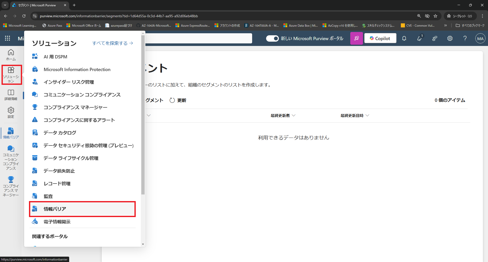
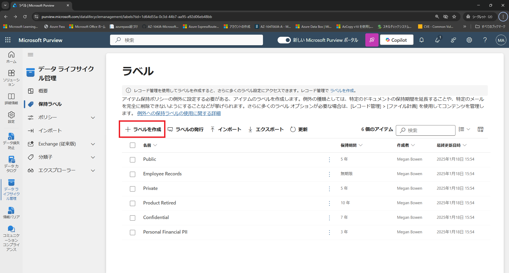
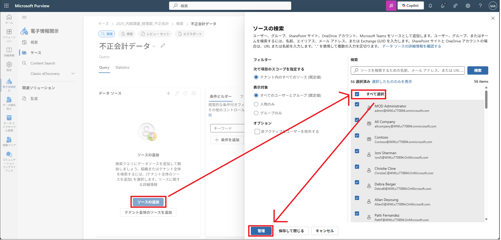

# ラボ03：Microsoft Purview を探索する

#### 推定時間: 35 分

> 注意：タスク1以降は、どのタスクから実施してもOKです。

### タスク 1 - Microsoft  Purview ポータルへアクセスする

1. https://purview.microsoft.com/ へアクセスし、以下のアカウントでサインインします。

   > 注：ハイパーリンクを開く際は、リンクを右クリックし[新しいタブで開く]等で開いてください。
   >
   > 注：XXXXはご自身のアカウント番号を入力してください。
   >
   > 注：[アカウントの保護にご協力ください]と表示された場合は[今はしない]を選択してください

   | 項目       | 値                                                           |
   | ---------- | ------------------------------------------------------------ |
   | ユーザーID | `admin@XXXXXXXXXXX.onmicrosoft.com` @マーク以降のXXXXXXXXXは各自異なります。 |
   | パスワード | Skillableで取得したパスワード                                |

   

1. [Microsoft Purview ポータル]が表示されます。

   

### タスク 2 - コンプライアンス マネージャーを確認する

> [解説]
>
> Microsoft Purview コンプライアンスマネージャーは、組織のコンプライアンス体制を効率的に管理・監視するためのツールで、Microsoft 365 環境全体のリスク管理や規制遵守状況の評価を支援します。このツールは、GDPR、ISO 27001、HIPAA などの国際的な規制や業界基準に基づいて、コンプライアンスのギャップを特定し、具体的な改善策を提案します。
>
> https://learn.microsoft.com/ja-jp/purview/compliance-manager-setup
>
> 注：ハイパーリンクを開く際は、リンクを右クリックし[新しいタブで開く]等で開いてください。

1. 左側のナビゲーション メニューの [ソリューション]をクリックし、[コンプライアンス マネージャー]をクリックします。

   

   

2. [コンプライアンス マネージャー]と表示されます。左側のナビゲーション メニューの[改善アクション]をクリックします。

   

   

3. 改善のための処置が一覧に表示されます。適当な項目をクリックし、詳細を確認します。

### タスク 3 - コミュニケーション コンプライアンスを確認する

> [解説]
>
> コミュニケーションコンプライアンス（Communication Compliance）は、組織内の従業員間のコミュニケーション（メール、チャット、ファイル共有など）を監視し、規制遵守や企業ポリシーに違反する行為を検出・対応するための Microsoft のソリューションです。特に、不適切な発言、ハラスメント、機密情報の漏洩などのリスクをリアルタイムで監視・管理し、企業のガバナンス強化に貢献します。
>
> この機能は、Microsoft Purview コンプライアンス ポータルの一部として提供され、Microsoft Teams、Exchange Online、SharePoint Online、OneDrive for Business など、Microsoft 365 の主要なコミュニケーションツールと連携して動作します。
>
> https://learn.microsoft.com/ja-jp/purview/communication-compliance-solution-overview
>
> 注：ハイパーリンクを開く際は、リンクを右クリックし[新しいタブで開く]等で開いてください。

1. 左側のナビゲーション メニューの [ソリューション]をクリックし、[コミュニケーション コンプライアンス]をクリックします。

   

2. [不適切なテキストを含むメッセージを調査する]の項目にある[ポリシーの作成]をクリックします。

   

   

3. [不適切なテキストの通信の検出]画面で以下の内容で入力し、[ポリシーの作成]をクリックします。

   | 項目           | 値                |
   | -------------- | ----------------- |
   | ポリシー名     | 不適切なテキスト  |
   | レビュー担当者 | MOD Administrator |

   

   

4. [ポリシーが作成されました]と表示されたら、[閉じる]をクリックします。

### タスク 4 - 情報バリアを確認する

> [解説]
>
> 情報バリア（Information Barriers）は、Microsoft 365 環境において、特定のユーザーやグループ間のコミュニケーションやコラボレーションを制限する機能です。これにより、法的・規制上の要件や社内ポリシーに基づいて、情報の不適切な共有や漏洩を防止し、組織内の利益相反やコンプライアンス違反を回避します。
>
> https://www.microsoft.com/ja-jp/security/business/information-protection/microsoft-purview-information-protection
>
> 注：ハイパーリンクを開く際は、リンクを右クリックし[新しいタブで開く]等で開いてください。

1. 左側のナビゲーション メニューの [ソリューション]をクリックし、[情報バリア]をクリックします。

   

   

2. [セグメント]をクリックし、さらに[新しいセグメント]をクリックします。

3. [セグメント名を指定してください]では名前を[法務部]にし、[次へ]をクリックします。

4. [ユーザー グループ フィルターの追加]では[Add]をクリックし、[部署]を選択し、[legal]と入力し、[次へ]をクリックします。

   

5. 内容を確認し[送信]をクリックします。[セグメントが作成されました]と表示されます。[完了]をクリックします。

6. タスク4-1～タスク4-5を繰り返し、経営企画セグメント (名前は[経営企画]、部署は[Management] )を作成します。

   > 注：法務（legal）と経営企画（Management）の2つセグメントを作成してから、次の手順に進んでください。

   

   

7. 左側のナビゲーション メニューの [ポリシー]をクリックし、[ポリシーの作成]をクリックします。

   

   

8. [ポリシー名を指定します]ではポリシー名を[法務-経営企画-禁止]と入力し、[次へ]をクリックします。

9. [割り当てられたセグメントの詳細を追加]では[セグメントを選択する]をクリックし、[法務部]を追加し、[次へ]をクリックします。

10. [コミュニケーションと共同作業の詳細の構成]ではオプションの選択で[禁止]を選び、[セグメントを選択する]をクリックし、[経営企画]を追加し、[次へ]をクリックします。

11. [ポリシーをアクティブな状態に設定します]は[オン]に変更し、[次へ]をクリックします。

12. 最後に確認して[送信]をクリックします。

    

    

13. 最後に[完了]をクリックし、設定が終了します。

### タスク 5 - データ ライフサイクル管理を確認する

> [解説]
>
> 保持ラベル（Retention Labels）は、Microsoft 365 環境においてデータのライフサイクル管理を実施するための重要な機能です。これにより、組織内のドキュメントやメールに対して保持（保存）や自動削除のポリシーを適用し、法規制や企業ポリシーに基づいたデータ管理を効率化します。
>
> https://learn.microsoft.com/ja-jp/purview/retention?tabs=table-overriden
>
> 注：ハイパーリンクを開く際は、リンクを右クリックし[新しいタブで開く]等で開いてください。

1. 左側のナビゲーション メニューの [ソリューション]をクリックし、[データ ライフサイクル管理]をクリックします。

   

   

2. 左側のナビゲーション メニューの[保持ラベル]をクリックし、さらに[＋ラベルを作成]ボタンをクリックします。

   

   

3. [保持ラベルに名前を付ける]では[給与記録–7年保持]と入力し、[次へ]をクリックします。

4. [ラベル設定の定義]は、[アイテムを無期限にまたは特定の期間保持する]を選び、[次へ]をクリックします。

5. [保持期間の定義]では[アイテムを保持する]は[7年]、[以下に基づき保持期間を開始する]では[アイテムの作成日時]を選び、[次へ]をクリックします。

6. [保持期間後の動作を選択する]では、何も変更せず、[次へ]をクリックします。

7. [確認と完了]では[ラベルを作成]をクリックします。

   

   

   

8. [保持ラベルが作成されました]と表示されます。[このラベルをMicrosoft365の場所に発行する]を選び、[完了]をクリックします。

9. [発行するラベルを選択]では、何も変更せず、[次へ]をクリックします。

10. [ポリシー スコープ]では、何も変更せず、[次へ]をクリックします。

11. [作成するアイテム保持ポリシーの種類を選択する]では、[静的]に変更し、[次へ]をクリックします。

12. [ラベルを公開する場所を選択する]では、何も変更せず、[次へ]をクリックします。

13. [ポリシーの名前を設定]では[給与保持ポリシー]と入力し、[次へ]をクリックします。

14. [完了]では[送信]をクリックします。

    

15. [保持ラベルが発行されました]と表示されます。[完了]をクリックして終了です。

    1 週間以内に、指定した場所のユーザーと管理者が保持ラベルを利用できるようになります。

### タスク 6 - データ損失防止を確認する

> [解説]
>
> データ損失防止（Data Loss Prevention: DLP） は、組織内の機密情報や重要データが不正に共有、送信、または漏洩するのを防ぐための技術やポリシーのことを指します。Microsoft 365 では、Microsoft Purview データ損失防止（DLP）機能を使用して、メール、ドキュメント、チャットなどの情報流出をリアルタイムで監視し、制御することができます。
>
> https://learn.microsoft.com/ja-jp/purview/dlp-learn-about-dlp
>
> 注：ハイパーリンクを開く際は、リンクを右クリックし[新しいタブで開く]等で開いてください。

1. 左側のナビゲーション メニューの [ソリューション]をクリックし、[データ損失防止]をクリックします。

   

2. 左側のナビゲーション メニューの[ポリシー]をクリックし、[ポリシーの作成]をクリックします。

   

3. [テンプレートの利用またはカスタム ポリシーの作成]では[すべての国または地域]で[日本]を選択します。

   

4. [金融]をクリックし、さらに[日本の財務データ]をクリックし、画面下にある[次へ]をクリックします。

5. [DLP ポリシーの名前の設定]は、変更せずに画面下にある[次へ]をクリックします。

6. [管理単位を割り当てる]は、変更せずに画面下にある[次へ]をクリックします。

7. [このポリシーの適用先を選択します]は、変更せずに画面下にある[次へ]をクリックします。

8. [ポリシーの設定の定義]は、変更せずに画面下にある[次へ]をクリックします。

9. [保護対象の情報]は、変更せずに画面下にある[次へ]をクリックします。

10. [保護処理]は、変更せずに画面下にある[次へ]をクリックします。

11. [アクセスと上書きの設定のカスタマイズ]は、変更せずに画面下にある[次へ]をクリックします。

12. [ポリシー モード]は、変更せずに画面下にある[次へ]をクリックします。

13. [確認と完了]では画面下にある[送信]をクリックします。

    

14. [新しいポリシーが作成されました]と表示されます。[完了]をクリックして終了です。

### タスク 7 - 電子情報開示を確認する

> [解説]
>
> 電子情報開示（eDiscovery）は、訴訟や調査に関連する電子データ（Eメール、ドキュメント、チャットなど）を特定・収集・保全・分析・提出するためのプロセスです。Microsoft 365 では、Microsoft Purview eDiscovery 機能を使用して、法的要件やコンプライアンス対応を効率的に実施できます。
>
> https://learn.microsoft.com/ja-jp/purview/ediscovery
>
> 注：ハイパーリンクを開く際は、リンクを右クリックし[新しいタブで開く]等で開いてください。

1. 左側のナビゲーション メニューの [ソリューション]をクリックし、[電子情報開示]をクリックします。

   

2. [ケース]をクリックし、さらに[ケースを作成]をクリックします。

   

3. [名前]には[2025_内部調査_経理部_不正会計]と入力し、[作成]をクリックします。

4. [検索の作成]をクリックし、さらに検索名には[不正会計データ]と入力し、[作成]をクリックします。

5. [不正会計データ]では[ソースの追加]をクリックし、[すべて選択]をクリックし、[管理]をクリックします。

   

6. [保存]をクリックします。

7. [不正会計データ]画面を一番下までスクロールします。[条件ビルダー] の [キーワード]に[売上帳]と入力します。

   

8. [不正会計データ]画面を一番上までスクロールして戻り、[クエリの実行] [Run Query]とクリックします。

   

   

   > 注：本来はデータがあれば、検索結果が表示されますが、何もでないので演習はここまでとします。

Lab03は以上です。お疲れ様でした。
